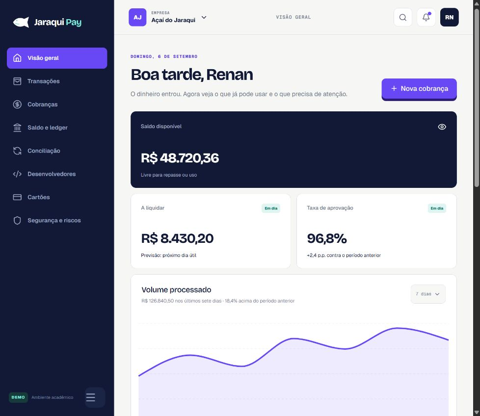
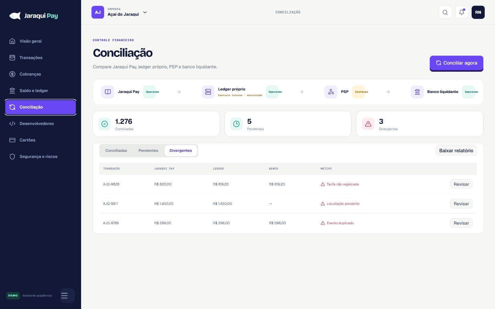

<p align="center">
  
</p>

# Jaraqui Pay

Protótipo navegável de uma infraestrutura de pagamentos para startups e SaaS brasileiros.

> **Trabalho acadêmico — Sistemas de Informação, 2026**

Fizemos este projeto para a disciplina de Governança, Gestão de Riscos e Integridade. A Jaraqui Pay não movimenta dinheiro real, não processa pagamentos reais e não representa uma instituição autorizada pelo Banco Central.

## O que dá pra ver no protótipo

- Landing page com posicionamento, console de API e fluxo do pagamento;
- Login demonstrativo, sem cadastro;
- Dashboard com saldo, liquidação, aprovação, transações e alertas;
- Transações Pix, boleto e cartão com estados simulados;
- Cobranças e QR Code Pix fictícios;
- Ledger próprio como registro oficial interno;
- Conciliação entre Jaraqui Pay, PSP e banco liquidante;
- API, idempotência, webhooks assinados, logs e reenvio;
- Cartão empresarial demonstrativo;
- Segurança, riscos e controles da operação.

Os dados exibidos são fictícios e ficam salvos apenas no navegador. Não existe backend financeiro nem integração real com PSP, banco, cartão ou Pix.

## Como executar

Requisitos: Node.js 22.13 ou superior.

```bash
npm install
npm run dev
```

Depois, abra o endereço local exibido pelo terminal. Para validar a versão de produção:

```bash
npm run build
npm run start
```

## Tecnologias

- Next.js/Vinext e React;
- TypeScript;
- Tailwind CSS e componentes shadcn;
- Lucide React;
- Recharts;
- Dados simulados tipados no próprio projeto.

## Escopo acadêmico

O protótipo acompanha o relatório de análise de riscos do projeto. Separamos visualmente API, PSP, ledger próprio e banco liquidante para facilitar a discussão sobre integridade, disponibilidade, conciliação, webhooks, proteção de dados e dependências operacionais.

Optamos por um ledger próprio no cenário: isso reduz a dependência de um ledger terceirizado, mas joga pra Jaraqui Pay a responsabilidade sobre consistência, concorrência, auditoria, backup, recuperação e reconciliação.

## Media kit

<p align="center">
  
  
</p>

Logos, paleta de cores, tipografia, mensagens aprovadas e roteiro de apresentação estão em [`mediakit/`](./mediakit).

## Equipe

Renan, Raffaela, Jakeline, Bianca e Gabrielly.

## Licença

O código original deste protótipo está disponível sob a licença [MIT](./LICENSE). O projeto é acadêmico, sem finalidade comercial e sem garantia de uso em produção.

